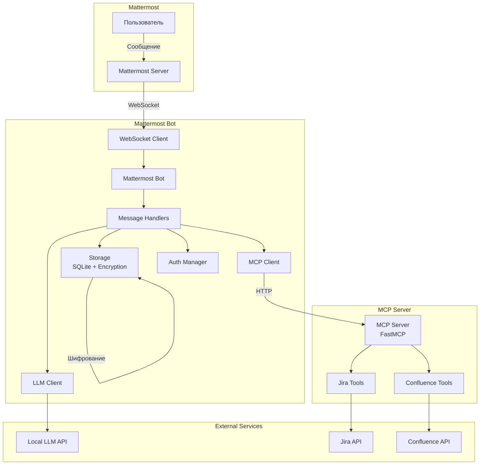
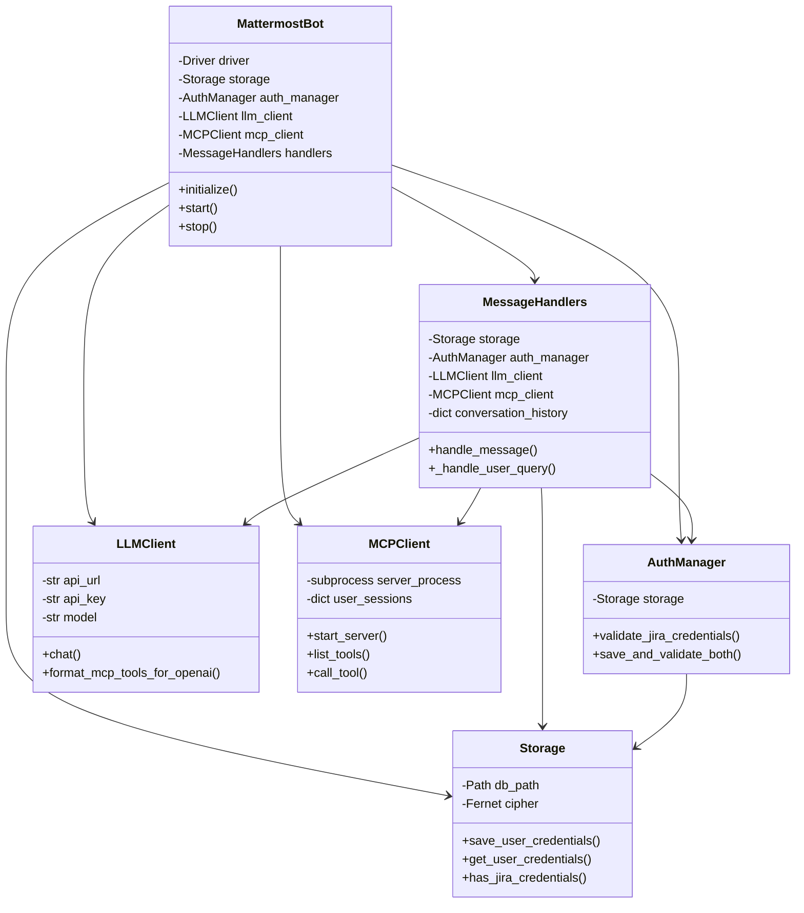
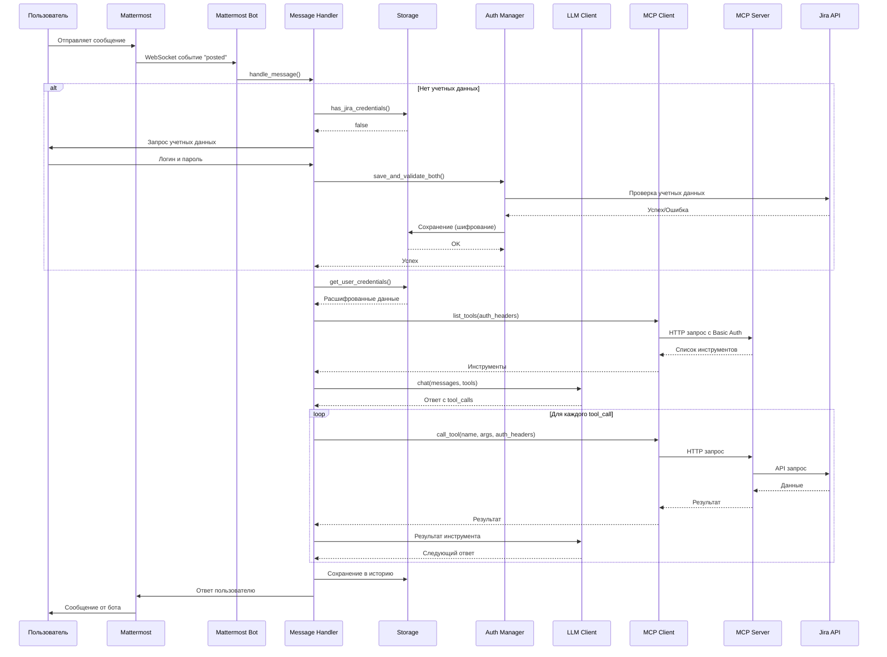
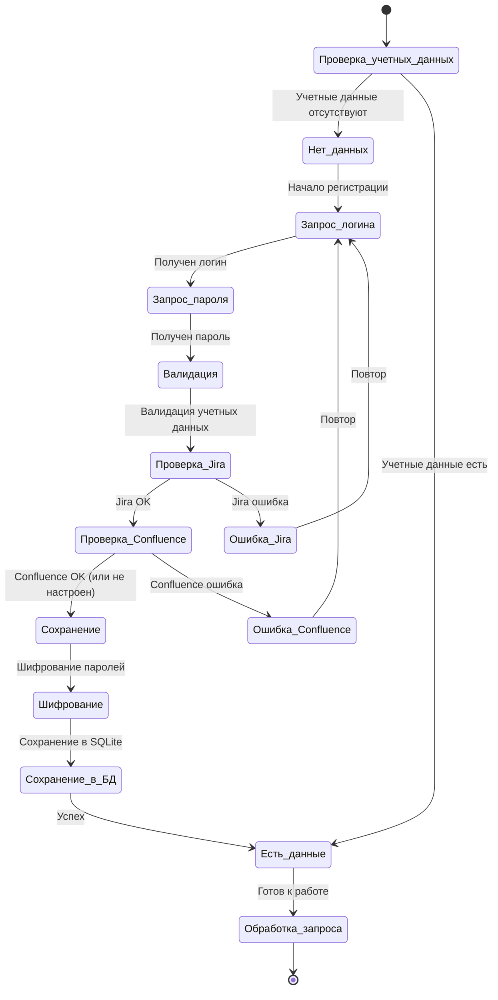
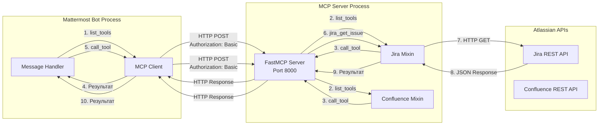
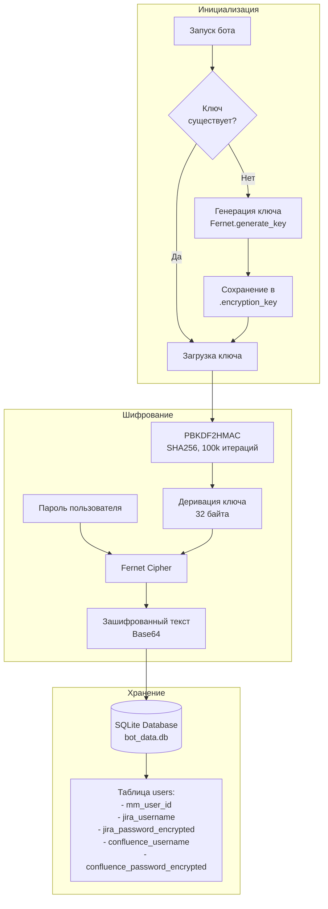
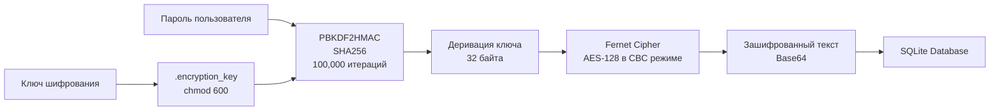

# MCP Atlassian Bot для Mattermost

Интеллектуальный бот для Mattermost, который позволяет пользователям взаимодействовать с Jira и Confluence через личные сообщения, используя локальную LLM и встроенный MCP (Model Context Protocol) сервер.

## 📋 Содержание

- [Обзор](#обзор)
- [Архитектура системы](#архитектура-системы)
- [Принципы работы](#принципы-работы)
- [Быстрый старт](#быстрый-старт)
- [Конфигурация](#конфигурация)
- [Использование](#использование)
- [Безопасность](#безопасность)
- [Устранение неполадок](#устранение-неполадок)

## 🎯 Обзор

Система состоит из двух основных компонентов:

1. **Mattermost Bot** - бот для Mattermost, который обрабатывает сообщения пользователей
2. **MCP Server** - сервер Model Context Protocol, предоставляющий инструменты для работы с Jira и Confluence

### Основные возможности

- ✅ **Личные сообщения** - работа только в личных чатах для конфиденциальности
- ✅ **Безопасное хранение** - учетные данные хранятся в зашифрованном виде
- ✅ **Индивидуальная аутентификация** - каждый пользователь работает со своими учетными данными
- ✅ **Интеграция с LLM** - использование локальной LLM для обработки запросов
- ✅ **Контекст беседы** - сохранение истории последних 10 обменов сообщениями
- ✅ **Поиск пользователей** - поиск пользователей Jira по имени, фамилии или email
- ✅ **Поиск трудозатрат** - поиск и анализ worklogs по пользователю и дате

## 🏗️ Архитектура системы

### Общая архитектура



### Компоненты системы



## 🔄 Принципы работы

### Поток обработки сообщения



### Процесс аутентификации



### Взаимодействие с MCP сервером



### Хранение и шифрование данных



## 🚀 Быстрый старт

### 1. Установка зависимостей

```bash
uv sync --frozen --all-extras --dev
```

### 2. Настройка переменных окружения

Скопируйте `.env.example` в `.env` и заполните необходимые переменные:

```bash
cp .env.example .env
```

**Обязательные переменные:**
- `MATTERMOST_URL` - URL вашего Mattermost сервера
- `MATTERMOST_TOKEN` - Токен бота (создайте бота в Mattermost)
- `LLM_BASE_URL` - URL локальной LLM (например, https://llm.1bitai.ru)
- `LLM_PROXY_TOKEN` - Токен для доступа к LLM API
- `LLM_MODEL` - Название модели LLM (например, qwen3:14b)
- `JIRA_URL` - URL вашего Jira сервера
- `CONFLUENCE_URL` - URL вашего Confluence сервера (опционально)

**Опциональные переменные:**
- `PORT` - Порт для MCP сервера (по умолчанию: 8000). Используется как для прямого запуска MCP сервера, так и для Mattermost бота
- `HOST` - Хост для MCP сервера (по умолчанию: 0.0.0.0 для прямого запуска, 127.0.0.1 для бота). Для Mattermost бота рекомендуется использовать 127.0.0.1

**Важно:** Глобальные учетные данные для Jira и Confluence **не требуются**, так как каждый пользователь авторизуется через Mattermost, предоставляя свои собственные учетные данные при первом взаимодействии с ботом.

### 3. Создание бота в Mattermost

1. Войдите в Mattermost как администратор
2. Перейдите в **Settings → Integrations → Bot Accounts**
3. Нажмите **Add Bot Account**
4. Заполните информацию о боте:
   - **Username**: например, `jira-bot`
   - **Display Name**: например, `Jira & Confluence Bot`
   - **Description**: описание бота
5. Сохраните и скопируйте **Access Token**
6. Добавьте токен в `.env` файл как `MATTERMOST_TOKEN`

### 4. Запуск бота

**Рекомендуемый способ (с автоматической очисткой процессов):**

```bash
./scripts/start_bot.sh
```

**Что делает скрипт `start_bot.sh`:**
- Проверяет наличие файла `.env`
- Автоматически завершает старые/зависшие процессы на порту 8000 (MCP сервер)
- Завершает старые процессы `mcp-atlassian` и `mattermost-bot`
- Запускает бота в чистом состоянии

**Запуск в фоновом режиме:**

```bash
nohup ./scripts/start_bot.sh > bot.log 2>&1 &
```

## ⚙️ Конфигурация

### Переменные окружения

Подробную информацию о всех переменных окружения см. в файле `.env.example`.

**Основные переменные:**

| Переменная | Описание | Обязательная |
|-----------|----------|--------------|
| `MATTERMOST_URL` | URL Mattermost сервера | Да |
| `MATTERMOST_TOKEN` | Токен бота Mattermost | Да |
| `LLM_BASE_URL` | URL локальной LLM API | Да |
| `LLM_PROXY_TOKEN` | Токен для доступа к LLM | Да |
| `LLM_MODEL` | Название модели LLM | Да |
| `JIRA_URL` | URL Jira сервера | Да |
| `CONFLUENCE_URL` | URL Confluence сервера | Нет |
| `MATTERMOST_SSL_VERIFY` | Проверка SSL сертификатов (true/false) | Нет |
| `PORT` | Порт для MCP сервера (по умолчанию: 8000) | Нет |
| `HOST` | Хост для MCP сервера (по умолчанию: 0.0.0.0 для прямого запуска, 127.0.0.1 для бота) | Нет |

## 💬 Использование

### Первое взаимодействие

1. Откройте личное сообщение с ботом в Mattermost
2. Отправьте любое сообщение (например, `/start` или "привет")
3. Бот покажет справку и начнет процесс настройки учетных данных

### Настройка учетных данных

Бот проведет вас через процесс настройки:

1. Введите ваш логин для Jira (он же используется для Confluence)
2. Введите ваш пароль (используется для Jira и Confluence)

**Важно:** Один пароль используется для доступа к обоим сервисам (Jira и Confluence). Учетные данные проверяются перед сохранением и хранятся в зашифрованном виде.

### Примеры запросов

**Поиск и анализ:**
- "Покажи мои открытые задачи в Jira"
- "Найди информацию о проекте PROJ в Confluence"
- "Покажи все задачи, назначенные на меня"
- "На каких проектах работает Сергей Журавлев?"
- "Какие у Олега Антонова трудозатраты за 5 декабря?"

**Создание и управление:**
- "Создай задачу в Jira с названием 'Новая задача'"
- "Обнови статус задачи PROJ-123 на 'В работе'"
- "Добавь комментарий к задаче PROJ-123"

**Контекст беседы:**
Бот помнит предыдущие сообщения в рамках одной беседы. Например:
1. Вы: "Покажи трудозатраты Олега Антонова за 5 декабря"
2. Бот: показывает результаты
3. Вы: "А за 6 декабря?" - бот поймёт, что речь о том же пользователе

### Команды

- `/help` или `помощь` - показать справку
- `/clear` или `сброс` - очистить историю беседы

## 🔒 Безопасность

### Шифрование паролей



**Особенности:**
- Пароли шифруются с использованием AES-256 через Fernet
- Ключ шифрования хранится отдельно от базы данных в файле `.encryption_key`
- Файл ключа имеет права доступа 600 (только для владельца)
- Используется PBKDF2 с 100,000 итерациями для деривации ключа

### Изоляция данных

- Каждый пользователь работает только со своими учетными данными
- Данные изолированы на уровне базы данных (по `mm_user_id`)
- MCP сервер использует заголовки авторизации для каждого пользователя отдельно

### Локальная LLM

- Все запросы обрабатываются локально
- Данные не отправляются в облачные сервисы
- Конфиденциальная информация остается в вашей инфраструктуре

## 🔧 Устранение неполадок

### Бот не отвечает

- Проверьте, что бот запущен и подключен к Mattermost
- Убедитесь, что токен бота правильный
- Проверьте логи бота на наличие ошибок
- Если бот "зависает" при запуске, используйте `./scripts/start_bot.sh` - он автоматически очистит старые процессы

### Ошибки аутентификации

- Убедитесь, что логин и пароль правильные
- Проверьте, что Jira/Confluence сервер доступен
- Для локальных серверов убедитесь, что SSL сертификаты настроены правильно

### Проблемы с LLM

- Убедитесь, что LLM сервер доступен по указанному URL
- Проверьте, что `LLM_BASE_URL` указывает на правильный адрес
- Убедитесь, что `LLM_PROXY_TOKEN` установлен и действителен
- Проверьте, что `LLM_MODEL` соответствует доступной модели на сервере
- Если LLM отвечает на английском, проверьте системный промпт в логах

### Проблемы с поиском пользователей

- Если пользователь не находится по имени, попробуйте использовать email
- Для поиска трудозатрат сначала найдите username через `search_users`
- Убедитесь, что у вас есть права доступа к проектам пользователя

### Проблемы с поиском трудозатрат

- Проверьте, что дата указана в формате YYYY-MM-DD
- Убедитесь, что используется правильный username (не displayName)
- Для больших периодов поиск может занять время - используйте фильтр по проекту для ускорения
- Если найдено мало результатов, проверьте, что `worklogAuthor` JQL поддерживается вашей версией Jira

## 📊 Технические детали

### MCP сервер

- Встроенный MCP сервер запускается автоматически при старте бота
- Порт и хост настраиваются через переменные окружения `PORT` (по умолчанию: 8000) и `HOST` (по умолчанию: 127.0.0.1 для бота)
- Использует транспорт `streamable-http` для HTTP API
- Поддерживает multi-user аутентификацию через заголовки `Authorization`

### Контекст беседы

- История сохраняется в памяти для каждого пользователя
- Максимум 20 сообщений (10 обменов: пользователь → бот)
- История очищается при команде `/clear` или при перезапуске бота

### Оптимизация поиска

- Для поиска worklogs используется оптимизированный JQL с `worklogAuthor` (если поддерживается)
- Автоматическая пагинация для получения всех результатов
- Лимит увеличен до 1000 для Server/DC

### Логирование

Логи бота выводятся в консоль. Для фонового запуска используйте перенаправление:

```bash
./scripts/start_bot.sh > bot.log 2>&1 &
tail -f bot.log  # для просмотра логов
```

Логи MCP сервера сохраняются в `~/.mcp_atlassian_logs/`:
- `mcp_server_stdout.log` - стандартный вывод
- `mcp_server_stderr.log` - ошибки

## 📝 Лицензия

Лицензировано под MIT - см. файл [LICENSE](LICENSE). Это не официальный продукт Atlassian.

## 🤝 Вклад в проект

Мы приветствуем вклад в проект! Если вы хотите внести вклад:

1. Ознакомьтесь с нашим руководством [AGENTS.md](AGENTS.md) для подробных инструкций
2. Внесите изменения и отправьте pull request

Мы используем pre-commit хуки для качества кода и следуем семантическому версионированию для релизов.
